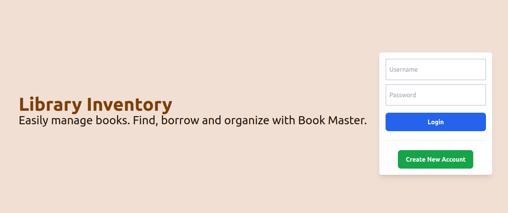
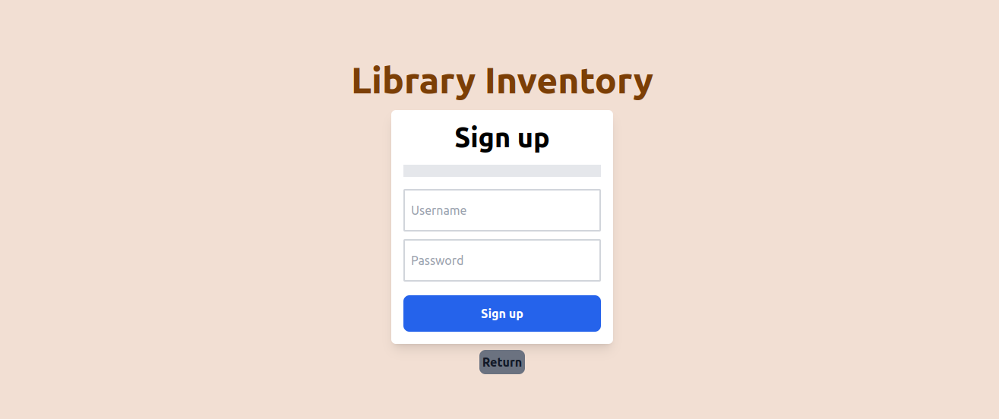
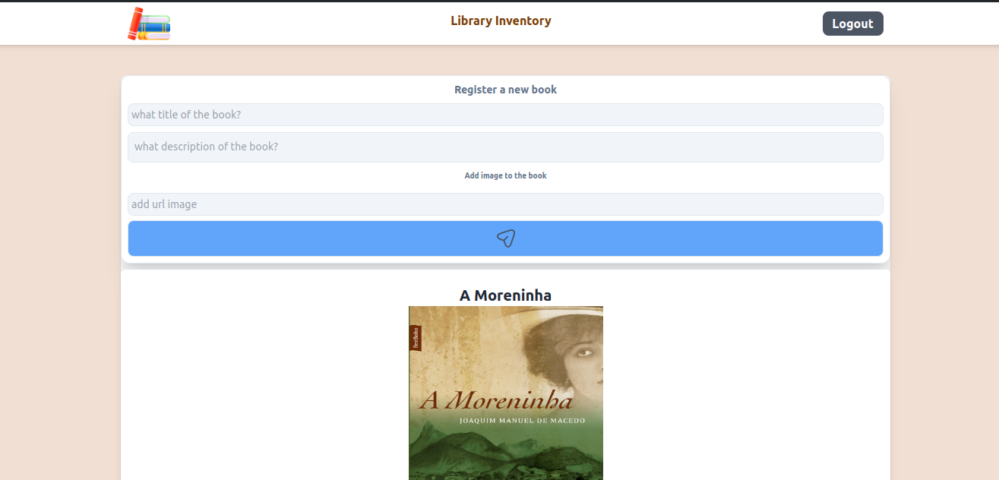
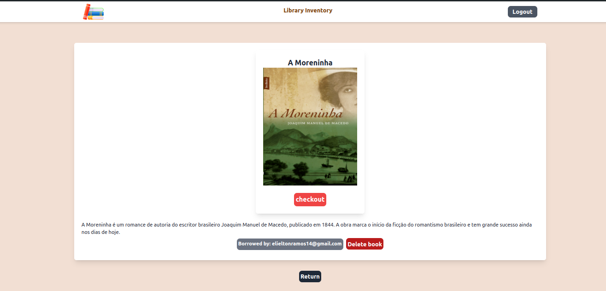

# Welcome to the FullStack Library Inventory Project Repository

## <p align="center">Repository FullStack</p>


<p align="center">
  
  
  
  
  
  
  
  
</p>

## 📚 About

I present the FullStack Library Inventory project, a project that has a frontend and a backend written in typescript that offers a complete book management system developed in Node.js. The frontend was built with React JS, Vite and Tailwind CSS. The backend was built with Express, Sequelize, node, TypeScript. The database used was PostgreSQL.

## 🚀 Technologies Used

[Node JS](https://nodejs.org/en/docs)

[JavaScript](https://developer.mozilla.org/pt-BR/docs/Web/JavaScript)

[Typescript](https://www.typescriptlang.org/)

[Tailwind](https://tailwindcss.com/)

[React JS](https://react.dev/)

[Vite](https://vitejs.dev/guide/)

[PostGreSQL](https://www.postgresql.org/)

[Express JS](https://expressjs.com/pt-br/)

[Jest](https://jestjs.io/pt-BR/docs/getting-started)

## index

- [Development Environment](#requirements)
- [Project standards](#project-standards)
- [Installation](#installation)
- [Use](#use)
- [Contact](#contact)
- [License](#license)

## Development Environment

To develop and run this application, it is necessary to configure an environment with the following tools:

**Node.js**: The application is developed in Node.js, a JavaScript/Typescript runtime platform, and is required to execute the code.

- [How to install Node.js](https://nodejs.org/en/download/package-manager)

Be sure to install and configure these tools in your development environment before starting the project.

## Installation

Clone this repository:
   ```bash
   git clone git@github.com:ElieltonRamos/Project-FullStack-Library-Inventory.git
   ```

Navigate to the project directory:

   ```bash
    cd Project-FullStack-Library-Inventory
   ```

Install the dependencies the frontend application by running the following command in the terminal:

   ``` bash
    cd frontend-library-inventory && npm install
   ```

Install the dependencies the backend application by running the following command in the terminal:

   ``` bash
    cd .. && cd backend-library-inventory && npm install
   ```


It is necessary to provide a PostgreSQL database for this backend

- you can install and start postgre locally
- [PostgreSQL](https://www.postgresql.org/download/)

- or you can use docker to create a container with postgreSQL

- [How to install docker](https://docs.docker.com/engine/install/ubuntu/)


```bash
docker run --name db_inventory -e POSTGRES_USER=root -e POSTGRES_PASSWORD=password -p 5432:5432 -d postgres
```

Start the backend application by running the following command in the terminal:

   ``` bash
    npm run dev
   ```

Start the frontend application by running the following command in the terminal:

   ``` bash
    cd .. && cd frontend-library-inventory && npm run dev
   ```

## Usage

<p align="center">
  
  
  
  
</p>

The front end application will be available at http://localhost:5173, where you can access the user interface and interact with the backend RESTful API.

The backend application will be available at http://localhost:3001, where you can access the RESTful API and interact with the database.

In the frontend-library-inventory and backend-library-inventory folders, you will find the appropriate README.md with detailed instructions on how to use and configure each part of the application. in addition to explanations about the routes, application functionalities and project patterns.

## Contact

Elielton Ramos

[](mailto:elieltonramos14@gmail.com)
[](https://www.linkedin.com/in/elielton-ramos/)
[](elielton6554)
[](https://www.instagram.com/elieltonramos08/)

## License

Open Source

This project is open source and available to the community. Feel free to explore, clone, and contribute to the project.

## Acknowledgements

Thank you for all the hours dedicated, challenges overcome, and lessons learned during the development of this project. Every line of code written was a step towards my growth as a developer and the success of this endeavor.

I would also like to extend my gratitude to all educational resources, documentation, and online communities that provided guidance, inspiration, and support throughout this process.

