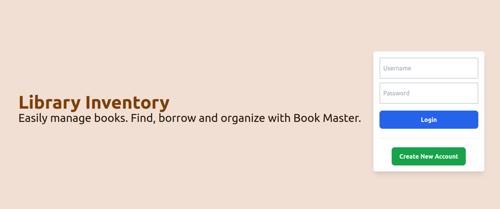
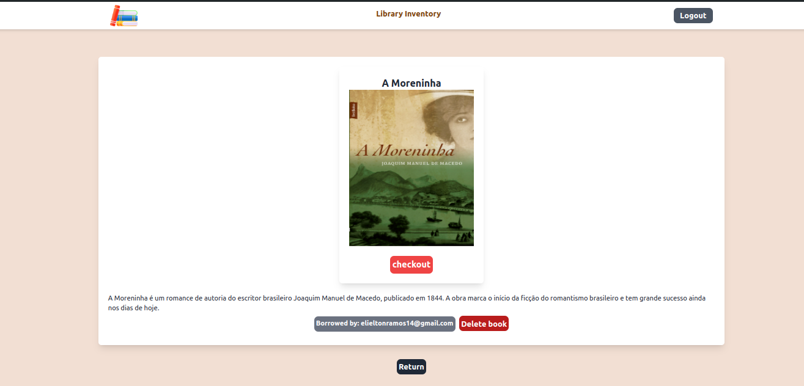
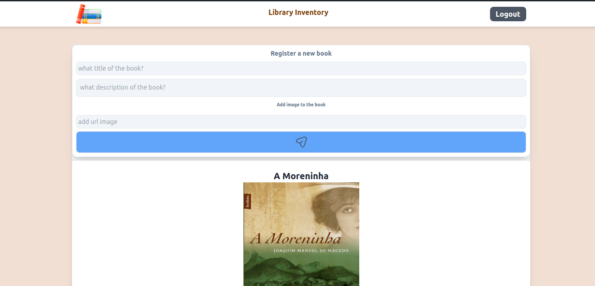
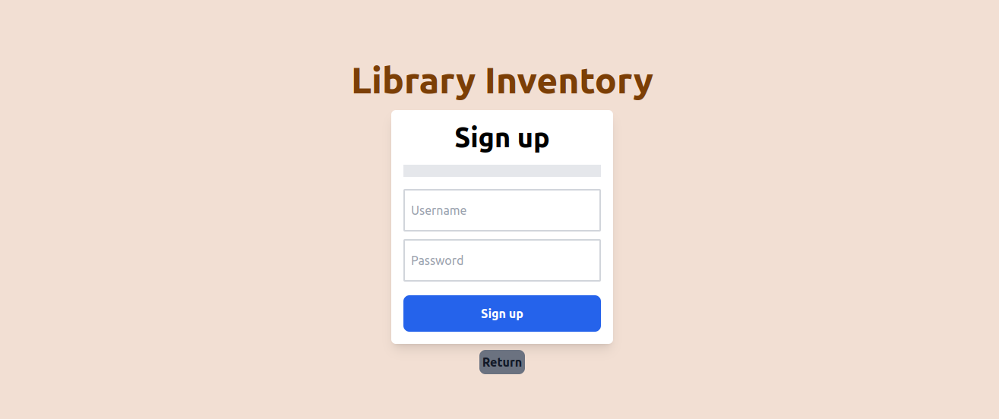

# Welcome to the FullStack Social Login Project Repository

## <p align="center">Repository Frontend</p>


<p align="center">
  
  
  
  
  
</p>

We present the library Inventory project, a frontend and backend project written in TypeScript that offers a complete book management system developed in Node.js. This is the project's frontend repository, developed with Vite, React, Tailwind CSS and TypeScript. The frontend provides an intuitive and responsive user interface for interacting with the backend's RESTful API.

## Technologies Used

[Node JS](https://nodejs.org/en/docs)

[JavaScript](https://developer.mozilla.org/pt-BR/docs/Web/JavaScript)

[Typescript](https://www.typescriptlang.org/)

[Tailwind](https://tailwindcss.com/)

[React JS](https://react.dev/)

[Vite](https://vitejs.dev/guide/)

## index

- [Development Environment](#requirements)
- [Project standards](#project-standards)
- [Installation](#installation)
- [Use](#use)
- [Contact](#contact)
- [License](#license)

## Development Environment

To develop and run this application, you need to set up an environment with the following tools:

**Node.js**: The application is developed in Node.js, a JavaScript/TypeScript runtime platform, and is required to run the code.

### You need to install Node JS on your machine

- [How to install Node.js](https://nodejs.org/en/download/package-manager)

Ensure you install and configure these tools in your development environment before starting the project.

## Installation

Clone this repository:

   ```bash
   git clone git@github.com:ElieltonRamos/Project-FullStack-Library-Inventory.git
   ```

Navigate to the project directory:

   ```bash
cd Project-FullStack-Library-Inventory/frontend-library-inventory
   ```

Install dependencies:

   ``` bash
npm install
   ```

Start the frontend:

   ``` bash
npm run dev
   ```

Remembering that the backend must be running for the frontend to work correctly. You can find the backend repository in the backend-library-inventory folder.

## Project Standards

  

The frontend was developed following a pattern of pages and components, allowing code reuse and facilitating application maintenance and scalability. The project structure is organized as follows:

- pages: contains the application pages, which are accessed through routes.
- components: contains the reusable components of the application, which are used in different parts of the application.
- services: contains the services that make calls to the backend's RESTful API.
- types: contains the types of data used in the application.

The project was developed with React, Tailwind CSS and Typescript, following the best code development and design practices, seeking to keep the code clean, organized and easy to maintain.

## Framework CSS

   

I used Tailwind CSS because it is a framework that allows creating customized and responsive user interfaces quickly and efficiently. It provides a series of utility classes that can be applied directly in the HTML, allowing flexible and consistent element styling, which facilitates development and code maintenance.

## Vite + React

   

I used Vite to create the frontend project because it is a fast and modern development environment that offers a high-quality development experience. Vite is a web application builder that provides a fast and efficient development environment with support for React, Vue, and other popular libraries. It offers a series of advanced features like fast loading, hot reloading, and TypeScript support, making web application development more productive and enjoyable.

## React JS

   

I used React to develop the application's user interface because it is a popular and widely used JavaScript library for creating interactive and responsive user interfaces. React offers a series of advanced features like reusable components, states, and properties, which facilitate the development of modern and scalable web applications. Additionally, React is highly flexible and extensible, allowing easy integration with other libraries and frameworks like Tailwind CSS and Vite.

## Typescript

   

I used TypeScript to develop the application because it is a typed and high-level programming language that offers support for static types and interfaces, helping to detect errors more efficiently and improve code quality. TypeScript is an extension of JavaScript that adds advanced features like static typing, classes, interfaces, and modules, making web application development safer, more productive, and scalable.

## Usage

<p align="center">
  
  
  
  
</p>


The front end application will be available at http://localhost:5173, where you can access the user interface and interact with the backend RESTful API. The frontend has the following pages available:

1. **Page: /**

  - Home page of the application, where you can log in with an already registered username and password.
   - If you enter an incorrect username or password, an error message will be displayed.
   - If you do not have an account, you can register by clicking the “Create New Account” button.
   - After logging in, the user will be redirected to the books page.

2. **Page: /register**

  - User registration page, where you can enter username and password to create an account.
   - If the username is already registered, an error message will be displayed.
   - If you want to return to the login page, you can click the “Return” button.
   - The username and password fields are mandatory.
   - After registration, the user will be redirected to the books page.

3. **Page: /book**

  - Books page, where you can view all registered books.
   - If there are no books registered, a message will be displayed informing you.
   - If you want to create a new book, you can fill out the form and click the “Send” button, blue button.
   - If you want to exit the application, you can click on the “Exit” button, icon in the top corner of the screen.
    - Each book informs if it is available or if it has been borrowed
    - There is a button to view the book details, redirects to the /book/:id page
    - It is only possible to access this page if the user is logged in

4. **Page: /book/:id**

- Shows the details of a book
- Displays whether a book is available or borrowed
- If the book is available and possible to borrow
- If the book is borrowed, it shows the user who borrowed this book
- It is possible to delete a book
- There is a button to return to the all books page

5. **Page: /not-found**

- 404 error page, if the route accessed does not exist.

## Contact

Elielton Ramos

[](mailto:elieltonramos14@gmail.com)
[](https://www.linkedin.com/in/elielton-ramos/)
[](elielton6554)
[](https://www.instagram.com/elieltonramos08/)

## License

Open Source

This project is open source and available to the community. Feel free to explore, clone, and contribute to the project.

## Acknowledgements

Thank you for all the hours dedicated, challenges overcome, and lessons learned during the development of this project. Every line of code written was a step towards my growth as a developer and the success of this endeavor.

I would also like to extend my gratitude to all educational resources, documentation, and online communities that provided guidance, inspiration, and support throughout this process.